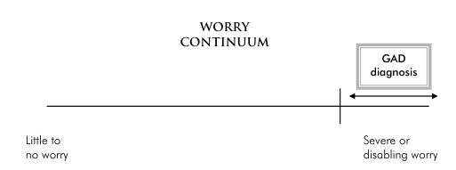

- Whereas worry takes place in the mind, anxiety takes place in the body
- Anxiety is the general name for a varied number of physical sensations that people experience when they're in danger or feel threatened in some way.
- Anxiety sensations can include:
    - racing heart
    - changes in breathing
    - stomach problems (butterflies to nausea / diarrhea)
    - sweating
    - trembling
    - hot flushes
    - cold chills
    - restlessness
    - jumpiness
    - dizziness
    - light headache
- Anxiety is a part of larger system in the body designated to respond to threats and danger (fight-or-flight)

&nbsp;

## **Problem with Anxiety:**

- Two major problems with anxiety systems:
    - It is triggered anytime you think you're in danger, even though you might not actually be in danger.
    - Its only an ideal mechanism for coping with physical danger - whereas in modern world, day-to-day threats aren't usually physical.

&nbsp;

## When Anxiety Becomes a Problem?

- Similar to worry, simply being anxious doesn't mean you have a problem
- Anxiety may be of different types:
    - Obsessive Compulsive Disorder (OCD), Phobias, etc.
- Mental health symptoms aren't binary. They are present to different degrees in all individuals.

&nbsp;        

- receiving the diagnosis of GAD means that a person's worry is at high end continuum - and the aim of treatment is to shift it lower
- diagnosis is also a matter of degree

&nbsp;

&nbsp;

&nbsp;