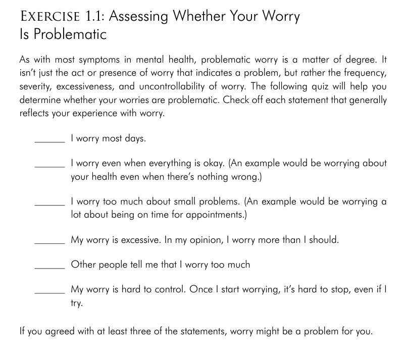

## **Worry**

- is a cognitive process that occurs in the mind
    
- involves mentally anticipating and preparing for a potentially negative outcomes in the future
    
- Anxiety is a natural and essential part of the body’s threat detection system, helping us respond quickly to danger. However, in the modern world, this system can sometimes work against us. Here are the two main problems with the anxiety system:
    
    - **False Alarms**: Anxiety is triggered not just by real danger but also by perceived danger. This means you can feel anxious even when you're actually safe, just because your mind *thinks* there’s a threat—similar to a smoke detector going off from burnt toast instead of a real fire.
        
    - **Outdated for Modern Stressors**: The system is designed to handle physical threats, but most modern-day anxieties are social or psychological (e.g., fear of embarrassment or failure). This mismatch causes the body to react with fight-or-flight responses even when those reactions aren’t helpful.
        
- In a state of anxiety, the mind is mentally planning and preparing for the future, building elaborate scenarios in an effort to predict what could happen and how you might deal with various situations.
    

&nbsp;

- Worry typically starts with what-if questions
- Worries are thoughts about the future
- Worries are always negative (catastrophic) - worst case scenario

&nbsp;

## **What triggers Worry?**

- experience of unpredictable (unclear), novel (new) or ambiguous (not well defined) events.
- We tend to worry more during the times of stress or major life problems.
- We are more likely to worry when:
    - we have increase in work responsibilities
    - when there's a significant event in your life
- The fact that you worry isn't the evidence that there's a problem.
- Worry becomes a problem when:
    - it is present most everyday
    - is excessive given the situation
    - interferes with a person's daily life or leads to significant distress
- A reduction in quality of life is also a signal for problem with worry.

&nbsp;

## Exercise 1.1 Accessing Whether your worry is Problematic:

- problematic worry is a matter of degree
- the act or presence of worry does not indicate a problem - but the frequency, severity, excessiveness, and uncontrollability of worry does

&nbsp;

&nbsp;

&nbsp;