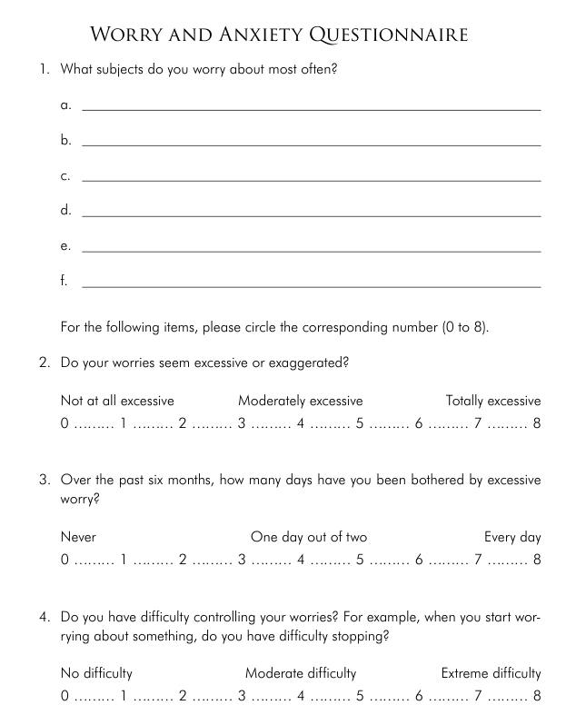
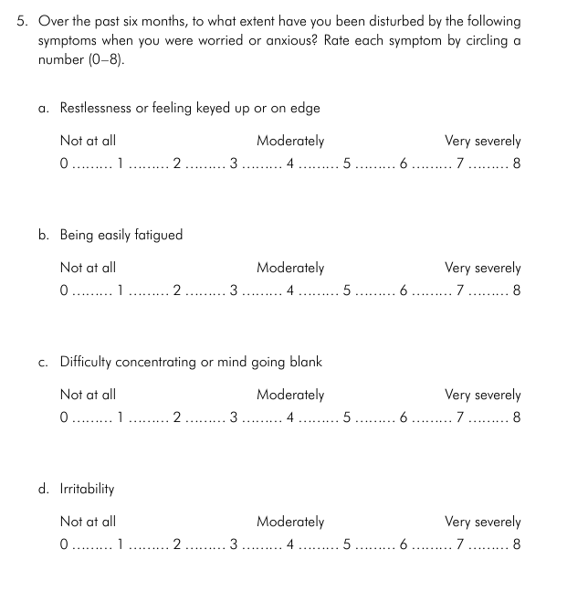
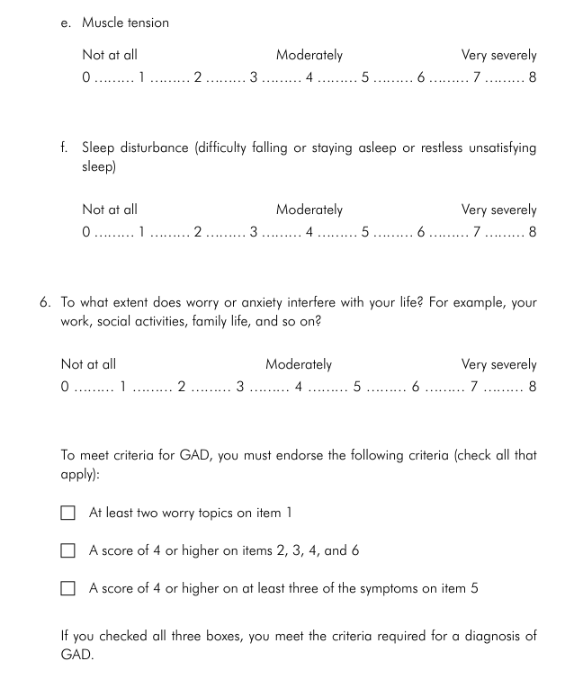

- Contrary to its name, the primary symptoms of GAD isn't anxiety, but rather excessive and uncontrollable worry about day-to-day event.
- In GAD, worry is chronic, meaning excessive worry has been present for at least six months and isn't solely due to stressors in life.
- Six physical symptoms, people with GAD experience:
    - Feeling restless, keyed up or on the edge
    - Being easily fatigued
    - Difficulty concentrating or mind going blank
    - Irritability
    - Muscle tension
    - Sleep disturbances

&nbsp;

Exercise 1.2 Assessing your GAD symptoms

&nbsp;