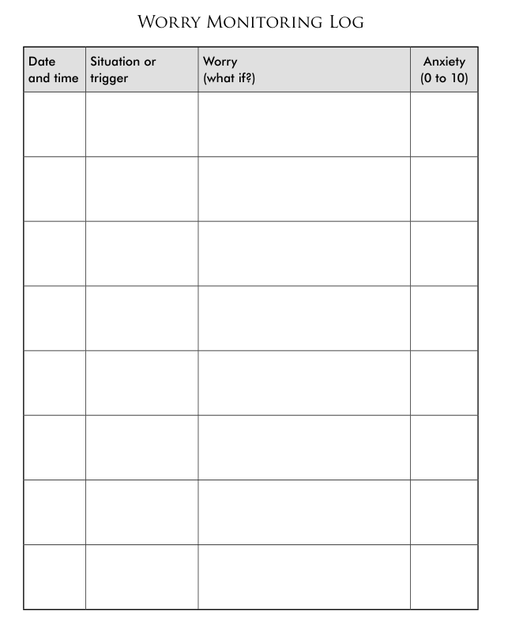
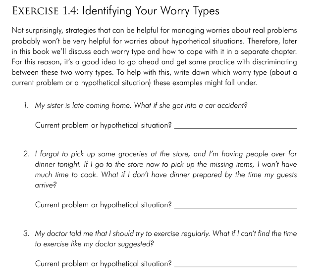

- Because worries are main feature of GADs, its important to understand your particular pattern of worrying.
- Ask yourself these questions:
    - What sort of things do you worry about?
    - Do certain worries come up more than others?
    - What typically triggers your worry?
    - How anxious do your worries make you?

&nbsp;

Exercise 1.3 Keeping a Worry Log - Scribble App

**Tips for filling out a Worry Monitoring Log:**

- Only complete the log at max three times a day (preferably even less)
- Use your anxiety as a cue
- Write down your worries as soon as you can
    - Write down the worry when it is fresh in your mind
    - If you wait a day or two, you might forget how anxious you were, what originally triggered your worry, or even the contents of the worry itself.
    - If you forget to write down your worries one day, don't record items from that day on the next day. Its better to let that day go and accurately record your current worries than to rely on your memory of what you think you worried about.

&nbsp;

**Recognizing Worry Type:**

- Classify your worries into two categories:
    - Worries about current problems (real problems -  you have control over these situations)
    - Worries about hypothetical situations (there's little you can do about these situations)

&nbsp;

## Exercise 1.4 Identifying Your Worry Types:

&nbsp;

## Exercise 1.5 Looking at your Worry Types

- After filling up your Worry Monitoring Log for a week, take a few moments to review each worry and try to classify your worry