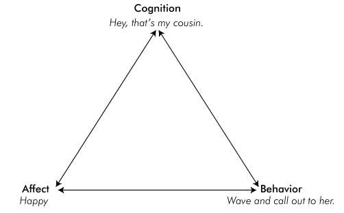
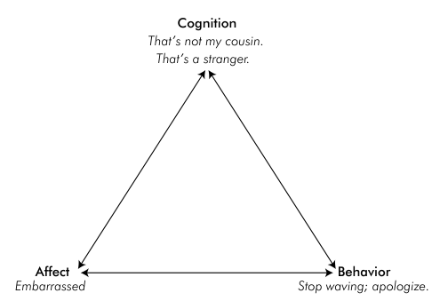
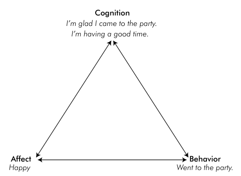
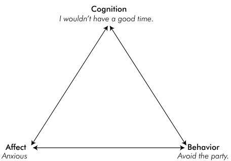
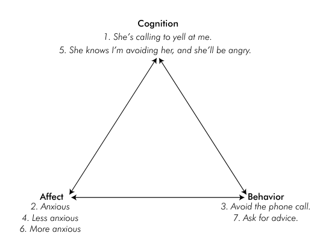
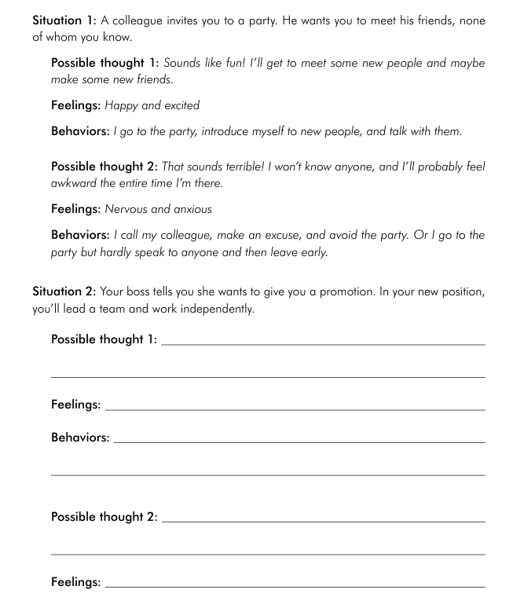
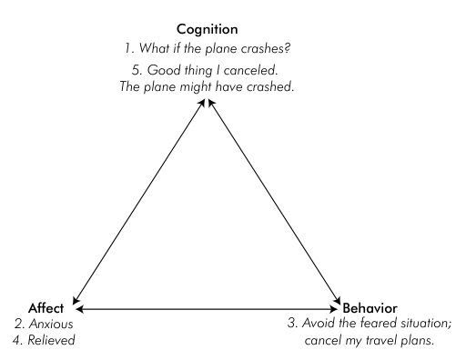
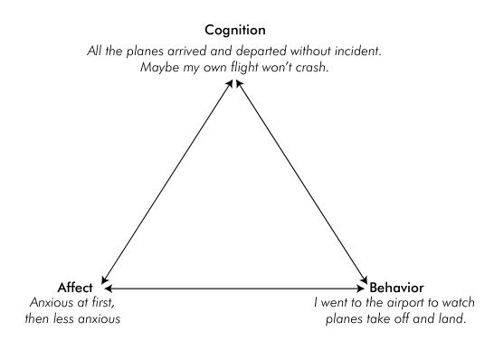
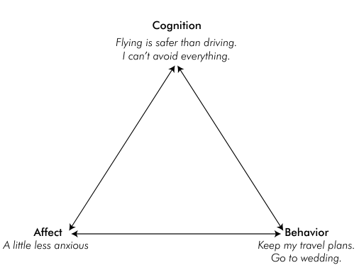

- Much of CBT is based on logical ideas, and if these ideas don't make sense to you, CBT is unlikely to be maximally helpful
- CBT is based on the simple concept that in most every situations you experience in life, you have certain feelings, and behaviors, and that these interact and influence each other.
- Because of this relationship, when you can recognize, and identify the thoughts and behaviors that lead to your feelings of distress, such as fear and anxiety, you can learn to change your way of thinking and behavior to reduce your negative feelings.
- CBT is based on ABC triangle - A (affect), B (behavior) and C (cognition)

- The above is the situation where you meet your cousin while walking.
- Same event can trigger different sort of results in all three components

&nbsp;

## Characteristics of ABC Triangle

**Reciprocal Relationship**

- The influence runs both way for each point. And, each point of triangle can effect other two.
- e.g. You go to a party, where you don't know anyone. You strike up conversations with multiple people

- Change in affect leads to change in behavior and cognition like the example above shows.

&nbsp;

**Vicious Cycle**

- The relationship between thoughts, feelings, and behaviors is that the cycle can repeat and amplify.

- This back and forth interaction between thoughts, feelings, and behaviors can be described as a vicious cycle - since each point of the triangle has an increasingly negative impact on the other two.

&nbsp;

**Exercise 2.1 Looking at how Thoughts influence Feelings and Behaviors**

&nbsp;

## What does CBT aim to change?

- Because thoughts, feelings, and behaviors influence one another, changing one point of the triangle can lead to changes in other two parts of the triangle.

  

- What was done in between was that the user went to the airport, watched the planes take off and land to view the evidence that plane flight is safe.
- This change in behavior changed the thought and affect (emotion)
- Same change can also be obtained by changing your thoughts (about flight).

 The impact of reevaluating your thoughts

- Although you can directly change what you do and reevaluate what you think, its much more difficult to change your emotions.
    - You can't decide not to be anxious.
- Therefore CBT targets emotions indirectly by focusing instead on recognizing and changing **thoughts** and **behaviors**.
- The primary target for change in CBT for GAD is thought (the excessive worries) not anxiety.
    - By targeting your worries, you can indirectly decrease your anxiety (because worries are perceived as threats).

&nbsp;

## CBT Principles and Expectations

- A primary goal of CBT is to help people learn skills they can use throughout their life to better manage difficult situations, feelings of distress, and problematic thoughts and behaviors - becoming your own therapist.

Focusing on the Here and Now:

- In CBT, the focus is on thoughts, behaviors and feelings in the present, rather than early childhood experience or distant past.
    - What might have originally caused a problem is often very different to present and what's keeping the problem alive.
- Identifying the root cause of the problem is still helpful. Though, it isn't the goal of CBT
- Practice the process again and again and again. Repeat! Record your experience

&nbsp;

**Some other Information about CBT for GAD:**

- intolerance of uncertainty has been shown to have strong relationship with GAD symptoms
- Motivation to change is the clear predictor of success.
- Being completely worry-free is not a realistic expectation
    - The goal is to manage worry, not eliminate them
    - A successful outcome is not to be anxiety-free, that's impossible
    - A more realistic goal is to have a toolbox of helpful strategies for managing worry and anxiety when they arise so you won't experience them as excessive or distressing.